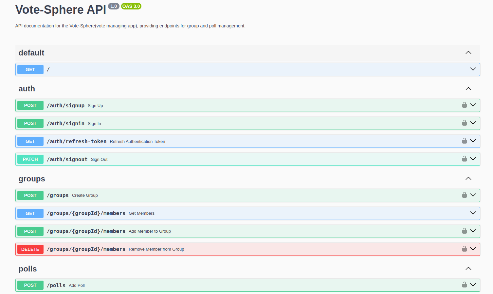

# VoteSphere - Group poll Manager

VoteSphere is a poll management application that allows users to work together within groups, managing polls efficiently. The application provides user authentication, authorization, and group-based poll management.

## Features

- **Authentication and Authorization:**

  - User registration, login, and logout.
  - Role-based access control (e.g., Admin, Member).

- **Group Management:**

  - Create groups and add members.
  - View and manage polls within groups.

- **Poll Management:**

  - Create polls within groups with question, and options.
  - View a list of polls within groups.
  - Cast a vote on polls.
  - Close polls

## Technologies Used

- **REST API with NestJS:**

  - Modular backend structure with separate modules for authentication and authorization, group management, and poll management.
  - JWT token-based authentication.

- **Swagger:**

  - Uses Swagger for documenting the API endpoints, making it easier for developers to understand and interact with the API.

- **Database Technology:**

  - Choose PostgreSQL for data storage.

- **Docker:**

  - Uses Docker for containerization, facilitating easy deployment of the database and the application itself.

## Installation

To run VoteSphere locally, follow these steps:

### Prerequisites

Ensure you have the following installed on your machine:

- [Node.js](https://nodejs.org/)
- [Docker](https://www.docker.com/)

### Step 1: Clone the Repository

```bash
git clone git@github.com:beka-birhanu/VoteSphere--backend.git
cd votesphere
```

### Step 2: Set up Environment Variables

Update the `.env` file in the root directory with your desired JWT secret:

```plain-text
JWT_SECRET=your_new_jwt_secret
```

### Step 3: Update Database password

Modify the docker-compose.yml file to set your PostgreSQL database password.

In `docker-compose.yml`:

```yml
db:
  image: postgres:13
  ports:
    - '5432:5432'
  environment:
    POSTGRES_USER: postgres
    POSTGRES_PASSWORD: your_new_password #change this line
    POSTGRES_DB: votesphere
  networks:
    - votesphere-networks
```

In `app.module.ts`:

```ts
TypeOrmModule.forRoot({
  type: 'postgres',
  host: 'db',
  port: 5432,
  username: 'postgres',
  password: 'your_new_password', // change this to the password you set in docker-compose.yml
  database: 'votesphere',
  autoLoadEntities: true,
  entities: [User, Group, PollOption, Poll],
  synchronize: true,
});
```

### Step 4: Start both the database and application

```bash
docker-compose up
```

## For Developers Who Want to Develop Frontend

To start the server, use the following command:

```bash
docker-compose down
docker-compose up
```

Then visit http://localhost:9000/api in your web browser to access the backend API.


## Contributing Guide

Thank you for contributing to our project! Here's how you can get started:

1. **Clone the Repository**: `git clone <repository_url>`
2. **Make Your Changes**: Modify the codebase as needed, following the design pattern promoted by NestJS
   - Modularity
   - Dependency Injection
   - Controllers and Services
   - Providers
   - Middlewares
   - Interceptors
   - Exception Handling
3. **Format Your Code**: Use Prettier to format your code with the given settings in `.prettierrc`.
4. **Test Your Changes**: Ensure they work as expected.
5. **Commit Your Changes**: `git add .` and `git commit -m "Description of changes"`
6. **Push Your Changes**: `git push origin <branch_name>`
7. **Create a Pull Request (PR)**: Explain your changes and submit the PR.
8. **Review and Merge**: I will review your PR and merge if appropriate.
9. **Celebrate!**: Your contribution is now part of the project.
